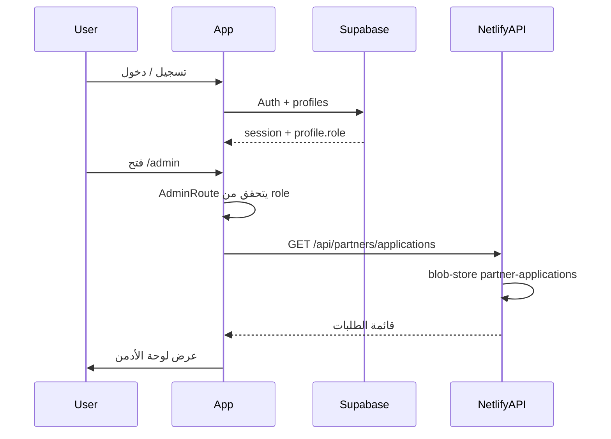

# خطة: التسجيل، تسجيل الدخول، ولوحة تحكم الأدمن

## الخيار التقني للمصادقة

يُنصح باستخدام **Supabase Auth** لأنّه يدعم تسجيل/دخول بالبريد وكلمة المرور، وإدارة أدوار (مثلاً `admin`) عبر جدول `profiles` أو metadata، ويمكن ربط لوحة الأدمن بنفس المشروع لاحقاً بقاعدة بيانات.

البديل: **Netlify Identity** إذا رغبت بعدم إضافة خدمة خارجية (أدمن يُدار من واجهة Netlify فقط أو عبر دالة مخصصة).

الخطة التالية مبنية على **Supabase Auth + جدول profiles** (أو تطبيق metadata) لتمييز الأدمن.

---

## 1. إعداد Supabase

- إنشاء مشروع Supabase (إن لم يكن موجوداً) وتفعيل Auth (Email/Password).
- إنشاء جدول `profiles` (أو استخدام `auth.users` + `raw_user_meta_data`):
  - `id` (uuid, primary key، يطابق `auth.users.id`)
  - `email` (نص)
  - `full_name` (نص، اختياري)
  - `role` (نص: `user` أو `admin`)
  - `created_at`
- تفعيل سياسة RLS بحيث:
  - المستخدم يقرأ/يحدّث ملفه فقط.
  - الأدمن يقرأ كلّ `profiles` (عبر سياسة شرط `role = 'admin'` أو دالة).
- (اختياري) Trigger عند إنشاء مستخدم جديد في Auth يدرج سطراً في `profiles` بقيمة `role = 'user'` افتراضياً. الأدمن يُعطى `role = 'admin'` يدوياً في DB أو من خلال أول مستخدم تُنشئه وتعدّله يدوياً.

---

## 2. الفرونت: المصادقة وواجهات التسجيل/الدخول

**الملفات المقترحة:**

- `**src/context/AuthContext.tsx**`
  - استدعاء `supabase.auth.getSession()` و`onAuthStateChange`.
  - توفير: `user`, `profile` (من `profiles`)، `loading`, `signUp`, `signIn`, `signOut`, و(اختياري) `isAdmin`.
  - جلب الـ profile بعد تحديد الـ session (استعلام من `profiles` حسب `user.id`).
- `**src/pages/Login.tsx**` و `**src/pages/Login.css**`
  - نموذج: بريد إلكتروني، كلمة مرور، زر "تسجيل الدخول".
  - رابط إلى صفحة التسجيل.
  - عند النجاح: إعادة توجيه إلى `/` أو إلى `/admin` إن كان المستخدم أدمن.
- `**src/pages/Register.tsx**` و `**src/pages/Register.css**`
  - نموذج: اسم كامل (اختياري)، بريد، كلمة مرور، تأكيد كلمة المرور.
  - استدعاء `signUp` من AuthContext ثم تسجيل الدخول أو إعادة توجيه لصفحة الدخول.
  - (إن وُجد trigger) الـ profile يُنشأ تلقائياً؛ وإلا استدعاء دالة أو Edge Function لإنشاء سطر في `profiles`.
- **حماية المسارات**
  - مكوّن `**ProtectedRoute**`: إن لم يكن المستخدم مسجّل الدخول يُوجّه إلى `/login`.
  - مكوّن `**AdminRoute**`: إن لم يكن المستخدم مسجّل الدخول أو `profile.role !== 'admin'` يُوجّه إلى `/` أو `/login`.
  - في [App.tsx](E:\wasila\src\App.tsx): استخدام `ProtectedRoute` لأي صفحة "شخصية" (مثلاً حساب المستخدم) و`AdminRoute` لجميع مسارات `/admin/*`.
- **ربط الواجهة**
  - في [More.tsx](E:\wasila\src\pages\More.tsx) أو الـ TopBar: إن كان المستخدم غير مسجّل: "تسجيل الدخول" و"إنشاء حساب" (روابط لـ `/login` و`/register`). إن كان مسجّل: "الملف الشخصي" و"تسجيل الخروج". إن كان أدمن: رابط "لوحة الأدمن" إلى `/admin`.
  - (اختياري) صفحة `**Profile.tsx**` بسيطة: عرض الاسم والبريد وتعديل الاسم.

---

## 3. لوحة تحكم الأدمن

**المسار والهيكل:**

- مسارات تحت `**/admin**` محمية بـ **AdminRoute** (فقط `role === 'admin'`).
  - مثال: `/admin` (قائمة/نظرة عامة)، `/admin/users`، `/admin/partners` (طلبات الشركاء).

**الصفحات المقترحة:**

- `**src/pages/admin/AdminLayout.tsx**`
  - تخطيط لوحة الأدمن: شريط جانبي أو علوي يحتوي روابط: "الرئيسية"، "المستخدمون"، "طلبات الشركاء"، و"تسجيل الخروج".
  - عرض `<Outlet />` لصفحات الأدمن الفرعية.
- `**src/pages/admin/AdminDashboard.tsx**`
  - صفحة `/admin`: إحصائيات سريعة (عدد المستخدمين، عدد طلبات الشركاء المعلقة، إلخ). يمكن جلب أرقام من Supabase (عدّ المستخدمين) ومن API موجودة لطلبات الشركاء.
- `**src/pages/admin/AdminUsers.tsx**`
  - قائمة المستخدمين من جدول `profiles` (مع pagination بسيط إن رغبت).
  - عرض: البريد، الاسم، الدور، تاريخ الإنشاء. بدون تعديل كلمات المرور من الواجهة.
- `**src/pages/admin/AdminPartners.tsx**`
  - قائمة طلبات الشركاء. مصدر البيانات الحالي: Netlify Blobs عبر [api-partners-apply](E:\wasila\netlify\functions\api-partners-apply.mts) الذي يخزّن في `partner-applications`.
  - تحتاج دالة Netlify جديدة: **GET** `/api/partners/applications` تقرأ من نفس المفتاح `partner-applications` وترجع القائمة (مع التحقق من JWT الأدمن إن أردت حماية الدالة).
  - في الواجهة: جدول أو بطاقات تعرض (نوع الطلب، اسم الشركة، البريد، الهاتف، الحالة، التاريخ).
  - أزرار "قبول" و"رفض" يحدّثان الحالة في Blob (دالة **PATCH** أو **POST** مثل `/api/partners/applications/:id/status`).

**تسلسل البيانات:**

---

## 4. دوال Netlify للطلبات والأدمن

- **GET `/api/partners/applications**`
  - قراءة `partner-applications` من blob-store وإرجاع القائمة.
  - (اختياري) التحقق من JWT من Supabase في الهيدر؛ إن لم يكن أدمن تُرجع 403.
- **PATCH أو POST `/api/partners/applications/:id/status**`
  - Body: `{ "status": "approved" | "rejected" }`.
  - تحديث العنصر المناسب في مصفوفة `partner-applications` ثم حفظها في Blob مرة أخرى.
  - (اختياري) نفس التحقق من الأدمن.

---

## 5. التبعيات والبيئة

- إضافة حزمة `**@supabase/supabase-js**` في المشروع.
- متغيرات بيئة (في Netlify وملف `.env` محلي): `VITE_SUPABASE_URL` و `VITE_SUPABASE_ANON_KEY` لاستخدامها من الفرونت.
- إنشاء عميل Supabase في الفرونت مرة واحدة (مثلاً في `AuthContext` أو `src/api/supabase.ts`) باستخدام هذه المتغيرات.

---

## 6. ترتيب التنفيذ المقترح

1. إعداد Supabase: المشروع، Auth، جدول `profiles`، RLS، و(إن وُجد) trigger لإنشاء profile.
2. إضافة `@supabase/supabase-js` وتهيئة العميل والمتغيرات.
3. تنفيذ AuthContext وصفحات Login و Register وربطها في App (مسارات عامة).
4. تنفيذ ProtectedRoute و AdminRoute وربط روابط "تسجيل الدخول" و"إنشاء حساب" و"لوحة الأدمن" من More أو TopBar.
5. تنفيذ GET/PATCH لطلبات الشركاء في Netlify ثم صفحة AdminPartners و AdminDashboard و AdminUsers و AdminLayout وربطها تحت `/admin`.

---

## ملاحظات

- **أول أدمن:** بعد إنشاء جدول `profiles`، تعيين `role = 'admin'` يدوياً لحساب واحد عبر Supabase Dashboard (أو استعلام SQL).
- **تأكيد البريد:** يمكن تفعيل "Confirm email" في Supabase؛ عندها بعد التسجيل يُرسل رابط تأكيد ولا يُعتبر المستخدم مسجّل دخول حتى يؤكّد (يمكن توضيح ذلك في صفحة التسجيل).
- **استرجاع كلمة المرور:** إضافة رابط "نسيت كلمة المرور" في صفحة Login يستدعي `supabase.auth.resetPasswordForEmail` وصفحة بسيطة لتغيير كلمة المرور عند الحاجة لاحقاً.

