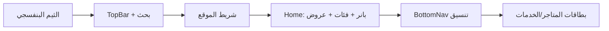

# خطة تصميم وسيلة على غرار كوبون

اعتماداً على لقطة واجهة كوبون المرفقة، الخطة تغطي المكونات التالية مع الحفاظ على مسارات وسيلة الحالية (متاجر، توصيل، مطاعم، طيران وفنادق، خدمات).

---

## 1. الهوية البصرية (الثيم)

**الملف:** [src/index.css](E:\wasila\src\index.css)

- استبدال اللون الأساسي الحالي (teal `#0d9488`) بثيم **بنفسجي** قريب من كوبون (مثلاً: primary `#6B21A8` أو `#7C3AED`, مع primary-light للخلفيات).
- تحديث `:root` و `[data-theme="dark"]` للبنفسجي مع الحفاظ على contrast النص والحدود.
- الاحتفاظ بمتغيرات الـ radius والظلال؛ تعديل الظلال إن لزم لتناسب الخلفيات البنفسجية.

---

## 2. الشريط العلوي (TopBar)

**الملفات:** [src/components/TopBar.tsx](E:\wasila\src\components\TopBar.tsx), [src/components/TopBar.css](E:\wasila\src\components\TopBar.css)

- **التخطيط (من اليمين لليسار في RTL):**
  - جهة اليمين: أيقونة السلة (مع العداد إن وُجد).
  - الوسط: **شريط بحث** بعرض مرن، placeholder مثل "بحث وسيلة" (لا يلزم ربط بحث فعلي في المرحلة الأولى؛ يمكن `#` أو عدم الانتقال).
  - جهة اليسار: شعار/لوجو وسيلة (نص أو أيقونة نجمة إن رغبت).
- جعل الشريط ثابتاً (sticky) مع خلفية بيضاء/سطح وحد سفلي خفيف كما في الصورة.

---

## 3. شريط الموقع (تحت الـ TopBar)

**مكون جديد أو توسيع الـ Layout**

- إضافة **شريط موقع** أسفل الـ TopBar مباشرة:
  - خلفية باللون البنفسجي الفاتح أو primary.
  - نص المدينة (مثلاً "الرياض") مع أيقونة سهم للأسفل (dropdown).
  - يمكن أن يكون اختيار المدينة وهمياً في البداية (state محلي فقط) دون تغيير بيانات من الخادم.

---

## 4. الصفحة الرئيسية (Home)

**الملفات:** [src/pages/Home.tsx](E:\wasila\src\pages\Home.tsx), [src/pages/Home.css](E:\wasila\src\pages\Home.css)

**الهيكل المقترح من أعلى لأسفل:**

1. **بانر دوّار (Carousel)**
  - منطقة واحدة أو أكثر (slide) لكل منها: صورة خلفية، عنوان، ونص فرعي (مثلاً "يصل إلى %50"، "ابتداء من X ر.س").
  - نقاط تنقل (dots) أسفل البانر.
  - يمكن استخدام مصدر صور وهمي (placeholder أو صورة واحدة) ونصوص ثابتة في البداية.
2. **قسم "الفئات"**
  - عنوان القسم: "الفئات".
  - عرض **أفقي قابل للتمرير** (horizontal scroll) لبطاقات التصنيفات:
    - كل بطاقة: أيقونة (خطية أو بسيطة بلون بنفسجي) + نص (متاجر، توصيل ركاب، مطاعم، طيران وفنادق، خدمات، واختياري: رمضان، أنشطة).
  - كل بطاقة تبقى مرتبطة بنفس المسارات الحالية (`/stores`, `/rides`, `/restaurants`, `/flights`, `/services`).
3. **قسم "عروض اليوم" أو "مميز لك"**
  - عنوان مثل "عروض اليوم".
  - شبكة **بطاقات (grid)** بصورة في الأعلى، ثم عنوان/وصف قصير.
  - في المرحلة الأولى يمكن ربط البطاقات بـ "متاجر مميزة" من `getStores()` (أول 4–6) أو قائمة ثابتة لعروض وهمية؛ كل بطاقة تؤدي إلى `/stores/:id` أو صفحة تفاصيل مناسبة.
4. **قسم الشريك**
  - الإبقاء على زر "انضم كشريك واربط متجرك بوسيلة" أسفل الصفحة مع تطبيق ألوان الثيم الجديد.

---

## 5. القائمة السفلية (BottomNav)

**الملفات:** [src/components/BottomNav.tsx](E:\wasila\src\components\BottomNav.tsx), [src/components/BottomNav.css](E:\wasila\src\components\BottomNav.css)

- **الخيار (أ) – محافظة على سلوك وسيلة الحالي:**  
الإبقاء على نفس العناصر (رئيسية، متاجر، توصيل، طيران، المزيد) مع تحديث التنسيق ليشبه كوبون: أيقونات أوضح، لون بنفسجي للعنصر النشط، وخلفية/حدود بسيطة.
- **الخيار (ب) – تقارب أكبر مع كوبون:**  
استبدال العناصر بأخرى مثل: الرئيسية، التصنيفات (تفتح قائمة أو صفحة الفئات)، السلة أو الطلبات، المزيد، الملف الشخصي (صفحة placeholder إن لزم). مع جعل الزر الأوسط إن وُجد أكثر بروزاً (مثل أيقونة القائمة في كوبون).

التوصية: البدء بالخيار (أ) لتقليل التغيير في المسارات، وإمكان تطبيق (ب) لاحقاً إذا رغبت بمطابقة أكبر.

---

## 6. بطاقات القوائم (المتاجر / الخدمات / العروض)

**الملفات المعنية:** [src/pages/Stores.css](E:\wasila\src\pages\Stores.css), [src/pages/ServicesList.css](E:\wasila\src\pages\ServicesList.css), وبطاقات "عروض اليوم" في الـ Home.

- جعل البطاقات **تعتمد على الصورة في الأعلى** (نسبة عرض إلى ارتفاع ثابتة، مثلاً 4:3).
- إن لم تتوفر صورة: استخدام لون/تدرج بنفسجي خفيف مع أيقونة أو حرف أول للاسم.
- إضافة **شارة اختيارية** (badge) في زاوية البطاقة (مثل "عرض خاص"، "خصم %X") لدعم جو العروض لاحقاً.
- النص: اسم المتجر/الخدمة/العرض أسفل الصورة، ووصف أو فئة بخط أصغر.
- استخدام نفس أسلوب البطاقة في صفحة المتاجر وصفحة الخدمات وقسم "عروض اليوم" في الرئيسية لاتساق المظهر مع كوبون.

---

## 7. ترتيب التنفيذ المقترح

1. تطبيق الثيم البنفسجي في `index.css`.
2. تعديل TopBar (بحث في الوسط، سلة، لوجو).
3. إضافة شريط الموقع تحت TopBar.
4. إعادة هيكلة Home: بانر، قسم الفئات أفقي، قسم عروض اليوم شبكي، ثم زر الشريك.
5. تحديث تنسيق BottomNav.
6. توحيد شكل البطاقات في المتاجر والخدمات والرئيسية (صورة أعلى، شارة اختيارية، نفس الـ grid).

---

## ملاحظات

- **البانر والصور:** يمكن استخدام `placeholder` من خدمة مثل picsum أو صورة واحدة ثابتة حتى يكون لديك محتوى حقيقي.
- **البحث:** يمكن أن يبقى واجهة فقط (لا استعلام API) أو يربط لاحقاً بصفحة بحث.
- **الدردشة:** ظهور فقاعة "نحن متصلون! كيف يمكنني أن أساعدك؟" يمكن تأجيله لمرحلة لاحقة بعد استقرار التصميم الأساسي.

