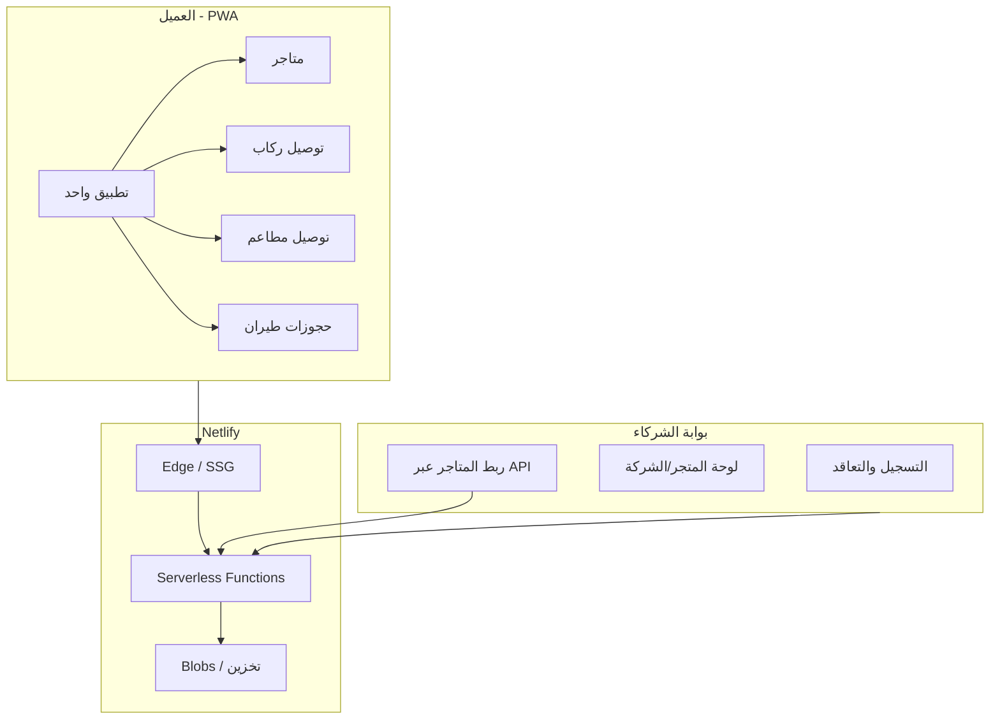

# خطة منصة سوبر-تطبيق (متاجر + توصيل + مطاعم + طيران)

## الرؤية والمعمارية

منصة واحدة (PWA) تعمل كـ **هاب** للخدمات: المستخدم يفتح تطبيقاً واحداً ويصل إلى المتاجر، التوصيل، المطاعم، وحجوزات الطيران. الشركات والمتاجر تنضم عبر **بوابة شركاء** وتُربط بالمنصة عبر APIs وواجهة إدارة.

---

## 1. التقنيات المقترحة

| الطبقة              | التقنية                                                                                                               |
| ------------------- | --------------------------------------------------------------------------------------------------------------------- |
| **Frontend (PWA)**  | React + TypeScript + Vite، `@netlify/vite-plugin`، Workbox أو Vite PWA plugin                                         |
| **البناء والنشر**   | Netlify (بناء من مصدر واحد، دوال في `netlify/functions`)                                                              |
| **الدوال والـ API** | Netlify Serverless Functions (TypeScript، `.mts`، `config.path` لمسارات واضحة)                                        |
| **البيانات**        | Netlify Blobs للبداية (حسابات، متاجر، طلبات أساسية). لاحقاً: إضافة Supabase أو DB خارجي للاستعلامات المعقدة والعلاقات |
| **الهوية**          | Netlify Identity أو Supabase Auth حسب اختيارك لاحقاً                                                                  |

---

## 2. هيكل المشروع (مختصر)

- `**/src**` — كود الـ PWA (صفحة رئيسية، أقسام: متاجر، توصيل ركاب، مطاعم، طيران، حساب، إشعارات).
- `**/netlify/functions**` — دوال مثل: `stores`, `rides`, `restaurants`, `flights`, `partners`, `auth`.
- `**netlify.toml**` — إعدادات البناء، الدوال، وإعادة التوجيه للـ SPA.
- **بوابة الشركاء** — قسم داخل نفس الـ PWA تحت مسار مثل `/partner` (تسجيل، تعاقد، ربط متجر، إحصائيات)، أو مشروع منفصل يستهلك نفس الـ APIs.

---

## 3. الوحدات الوظيفية (كبداية)

- **المتاجر**
  - عرض متاجر منصة + متاجر شركاء (من Blobs أو DB).
  - تفاصيل متجر، منتجات، سلة، طلب (بداية بسيطة).
- **توصيل ركاب**
  - طلب رحلة (من–إلى، نوع)، عرض سعر تقديري، حالة الرحلة.
  - ربط لاحق مع شركات نقل (API شركاء).
- **توصيل مطاعم**
  - قائمة مطاعم، قوائم طعام، سلة، طلب توصيل وعنوان.
- **حجوزات طيران**
  - بحث (من–إلى، تاريخ)، عرض رحلات تجريبية/ثابتة، خطوة حجز بسيطة.
  - ربط لاحق مع مزودي الطيران أو وكالات عبر API.

التصميم الموحد: نفس نظام التصميم (ألوان، خطوط، بطاقات، تنقل سفلي) مع تغيير المحتوى فقط لكل خدمة.

---

## 4. تصميم حديث بأعلى المواصفات

- **نظام تصميم**
  - خط عربي واضح (مثل: Noto Sans Arabic أو IBM Plex Sans Arabic)، دعم RTL كامل.
  - ألوان أساسية محددة (براند)، أوضاع فاتح/داكن، تباين عالي للقراءة والوصولية.
- **تجربة المستخدم**
  - تنقل سفلي (Bottom navigation) للوصول السريع: رئيسية، متاجر، توصيل، طيران، أكثر.
  - صفحة رئيسية: بطاقات كبيرة لكل خدمة (مثل المطار/كيتا)، بحث موحد، عروض سريعة.
  - قوائم وبطاقات منتجات/رحلات واضحة، حالات تحميل وأخطاء ورسائل فارغة موحدة.
- **أداء و PWA**
  - تحميل كسول للأقسام، تخزين مؤقت للبيانات الأساسية، Service Worker للتخزين offline-light ووضع "مثبت على الشاشة الرئيسية".
  - `manifest.json`: أيقونة، اسم التطبيق، ألوان الثيم.

---

## 5. التعاقد وربط المتاجر داخل المنصة

- **بوابة شركاء (Partner onboarding)**
  - صفحة "انضم كشريك" → نموذج (نوع الخدمة: متجر / نقل / مطعم / طيران)، بيانات الشركة، الموافقة على الشروط.
  - حفظ طلبات الانضمام في Blobs (أو DB)، وواجهة إدارية بسيطة للموافقة/الرفض.
- **ربط المتاجر**
  - لكل شريك معتمد: لوحة (Dashboard) تعرض الطلبات والإحصائيات البسيطة.
  - **API لربط المتاجر**: دوال Netlify محمية (مثلاً بـ API key أو JWT) تقبل:
    - تسجيل/تحديث متجر (اسم، وصف، فئة، لوجو، عناوين).
    - رفع منتجات/قوائم (مطعم أو متجر).
    - تحديث حالة الطلب (قيد التحضير، تم التوصيل، إلخ).
  - توثيق بسيط (مستند أو صفحة `/partner/api-docs`) تشرح الـ endpoints وكيفية الحصول على المفتاح.

---

## 6. مراحل التنفيذ المقترحة

1. **إعداد المشروع**
  - إنشاء مشروع Vite + React + TypeScript، إضافة `@netlify/vite-plugin` و `netlify.toml`، وتهيئة PWA (manifest + service worker).
2. **نظام التصميم والصفحة الرئيسية**
  - نظام ألوان/خطوط/مكونات أساسية، دعم RTL، والصفحة الرئيسية ببطاقات الخدمات الأربع والتنقل السفلي.
3. **المتاجر (أول خدمة)**
  - واجهة عرض المتاجر والمنتجات، سلة، وطلب بسيط؛ دوال `netlify/functions` لقراءة/كتابة المتاجر والطلبات في Blobs.
4. **توصيل ركاب + توصيل مطاعم**
  - واجهات طلب رحلة وطلب مطعم، دوال للطلبات وحالاتها، ربط لاحق بشركاء.
5. **حجوزات طيران**
  - بحث وعرض رحلات، خطوة حجز بسيطة، دوال للرحلات والحجوزات.
6. **بوابة الشركاء وربط المتاجر**
  - صفحات التسجيل والموافقة، لوحة الشريك، وAPI موثق لربط المتاجر والمنتجات والطلبات.

---

## 7. ملاحظات تنفيذية (Netlify)

- الدوال في `netlify/functions` بصيغة حديثة (مثلاً `export default async (req, context) => ...` مع `export const config = { path: "/api/..." }`).
- الأسرار ومفاتيح الـ API للشركاء في Environment Variables عبر Netlify، والوصول عبر `Netlify.env` داخل الدوال.
- للبيانات الأكثر تعقيداً لاحقاً: استخدام Supabase (أو DB آخر) مع الاحتفاظ بالدوال على Netlify كطبقة API موحدة للمنصة والشركاء.

إذا رغبت، يمكن تفصيل مرحلة واحدة (مثلاً المتاجر + بوابة الشركاء) إلى مهام فرعية جاهزة للتنفيذ خطوة بخطوة.